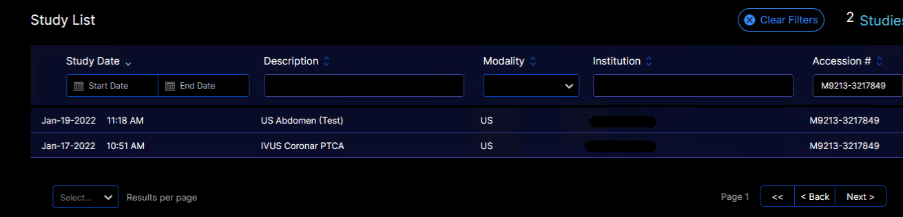
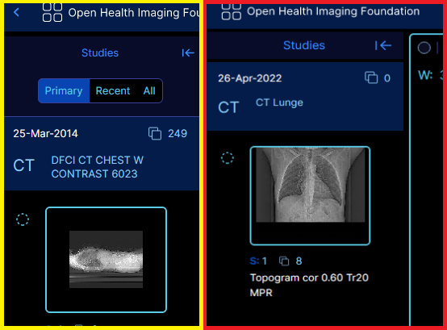

# Installation
The prefered installation-method is docker.

The most important detail when installing OHIF, is CORS. This means that the WADO, QIDO and OHIF service need to run on the same port or domain. For hosting, it is ideal to expose the QIDO endpoint and OHIF through a proxy, so that the user only needs to access a single IP-adress and it also makes it easier to install SSL-certificates and similar things.
## Preparation:
The following parameters need to be known before installation:
- QIOD-SF URL
- The port OHIF should be exposed to the outside world.
- If the installation is anything but a local test-installation, ssl certificates are needed

Before the service startup serveral things need to be configured:
- go into the folder 'docker' in the root of this repository.
- there you will find a docker-compose.yml, a nginx.conf file and an ohif.js file.
1) configure the NGINX file, change the QIDO-SF address, the address where OHIF is hosted and possible add a certificate.
2) you might have to change the docker-compose file so it uses the correct ports
3) you might want to add a logo

For a more detailed description please refere to the instructions under: https://hub.docker.com/r/elgagmbh/elga-ohif3

# Changes & Technical Description

## DicomWebCommunication
The QIOD requests were changed to include the DICOM Issuer of Patient ID, AccessionNumber and  Issuer of Accession Number for the DicomWebDataSource.

## StudyListViewer
A new view called 'ELGAStudyListViewer' based on the default StudyListViewer was created. It expects the get-parameters 'issuerOfPatientId', 'patientId' and 'hcp'. If they are not given, the following error message will be displayed:

```
Konnte keine Daten laden:

    Bitte PatientId angeben!
    Bitte IssuerOfPatientId angegeben!
    Bitte HCP-Token angegeben!
```

The prameters 'issuerOfAccessionNumber' and 'accession' are optional parameters that can be set as get-parameters to filter by the accessionnumber. It is only possible to use both parameters at the same time. If one is not set, then an error message will be displayed.

If more than one study is available with the given get-parameters, a list will be displayed, from which the user can choose one entry to view.



The columns were changed from OHIF-base to better reflect the needs of useres in an ELGA-Envirnoment, as well as

If only one study is found, the Image-Viewer will directly be opened with this one study. This can happen, if the patient only has one study, or the filters where set so that only this one study is found.

## Viewer

In this version only the default Ohif-Viewer is available.
The GUI elements of the default-Viewer were changed, so that changing between studies is no longer possible. This was done due to increased loading times and possible unnecessary Qido-queries when loading the StudyList with the 'issuerOfAccessionNumber' and 'accession' - parameters.


The left, yellow marked Study List Viewer is part of the StudyViewer, where the user is able to switch between series and studies. For the study-switcher to work, all studies of the patient need to be loaded. In the ELGA-Environment this means siginificantly higher loading times without any major gain in usability. This feature as seen on the right, red marked side was removed.
